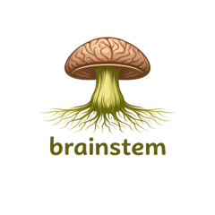
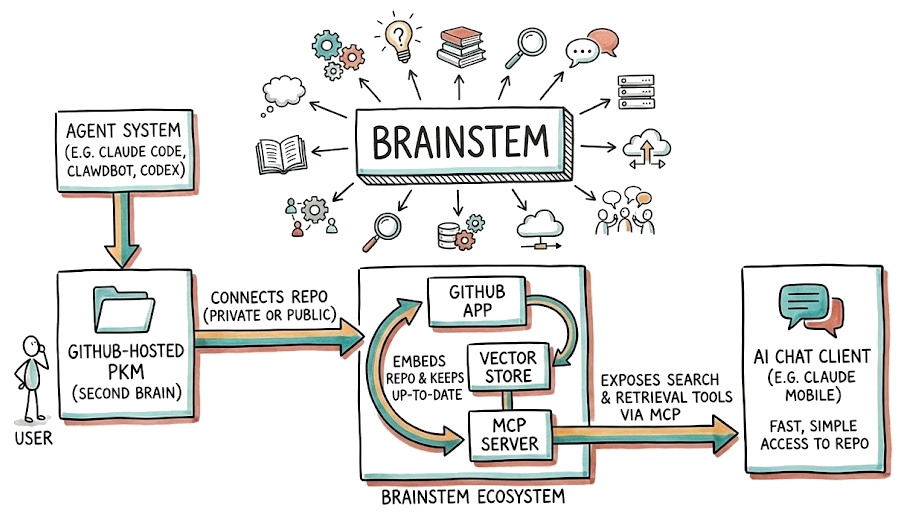

<p align="center">
  
</p>

<h1 align="center">Brainstem</h1>

<p align="center"><strong>Give your AI a second brain.</strong></p>

---

You maintain a personal knowledge base — notes, docs, references — in a GitHub repo. Maybe you use Obsidian, Logseq, or just plain markdown. Maybe you use Claude Code, ClawdBot, Codex, or another agent to help maintain it.

**Brainstem** connects that repo to your AI chat clients so you can search and retrieve your own knowledge from anywhere — your phone, your desktop, or any MCP-compatible tool.

Here's how it works:

1. **You have a GitHub-hosted PKM** (personal knowledge management) repo, public or private
2. **You install the Brainstem GitHub App** on that repo
3. **Brainstem embeds your content** and keeps its index up-to-date with every push
4. **Brainstem exposes search & retrieval tools via MCP** that you connect to any compatible AI client (Claude Mobile, Claude Desktop, Claude Code, etc.)

That's it. Push to GitHub, and your AI can search it within a minute.

<p align="center">
  
</p>

## Quick Start

### 1. Connect Your Repository

1. Visit [brainstem.cc/setup](https://brainstem.cc/setup)
2. Click **Connect Repository** to install the GitHub App
3. Select your repository
4. Copy your unique MCP endpoint URL from the success page

### 2. Authenticate

1. Visit [brainstem.cc/oauth/authorize](https://brainstem.cc/oauth/authorize)
2. Authorize with GitHub
3. Copy your session token

### 3. Connect Your AI Client

#### Claude Desktop / Claude Code

Add to your MCP config:

```json
{
  "mcpServers": {
    "my-brain": {
      "url": "https://brainstem.cc/mcp/{your-uuid}",
      "headers": {
        "Authorization": "Bearer <your-session-token>"
      }
    }
  }
}
```

#### Claude.ai (Web)

Settings → Connectors → Add custom connector → paste your endpoint URL and add the Authorization header.

## MCP Tools

Brainstem exposes five tools over MCP:

| Tool | Description |
|------|-------------|
| `search_brain` | Semantic search across your knowledge base. Results include source links back to GitHub. The tool description dynamically reflects your actual content domains and topics. |
| `get_document` | Retrieve the full contents of a file by its path. |
| `list_recent` | List recently modified files, optionally filtered by path prefix. |
| `list_folders` | Browse the folder structure of your repo. |
| `about` | Information about the Brainstem server and what it does. |

## How Sync Works

```
GitHub Push → Webhook → Brainstem Worker → R2 Storage → AI Search (reindex)
```

- When you push to your connected repo, GitHub sends a webhook to Brainstem
- Brainstem fetches the changed files via the GitHub API and stores them in Cloudflare R2
- A reindex is triggered on Cloudflare AI Search
- New content is searchable within ~1 minute

Sync is incremental — only changed files are fetched on each push.

## Architecture

Built on Cloudflare's stack:

- **Cloudflare Workers** with Durable Objects for MCP session state
- **Cloudflare R2** for file storage
- **Cloudflare D1** (SQLite) for installation and user tracking
- **Cloudflare AI Search** for semantic search and retrieval
- **GitHub App** for authentication, webhooks, and repo access

## Documentation

- [TROUBLESHOOTING.md](./TROUBLESHOOTING.md) — Common issues and solutions
- [CLAUDE.md](./CLAUDE.md) — Implementation details and development guide

## License

ISC
